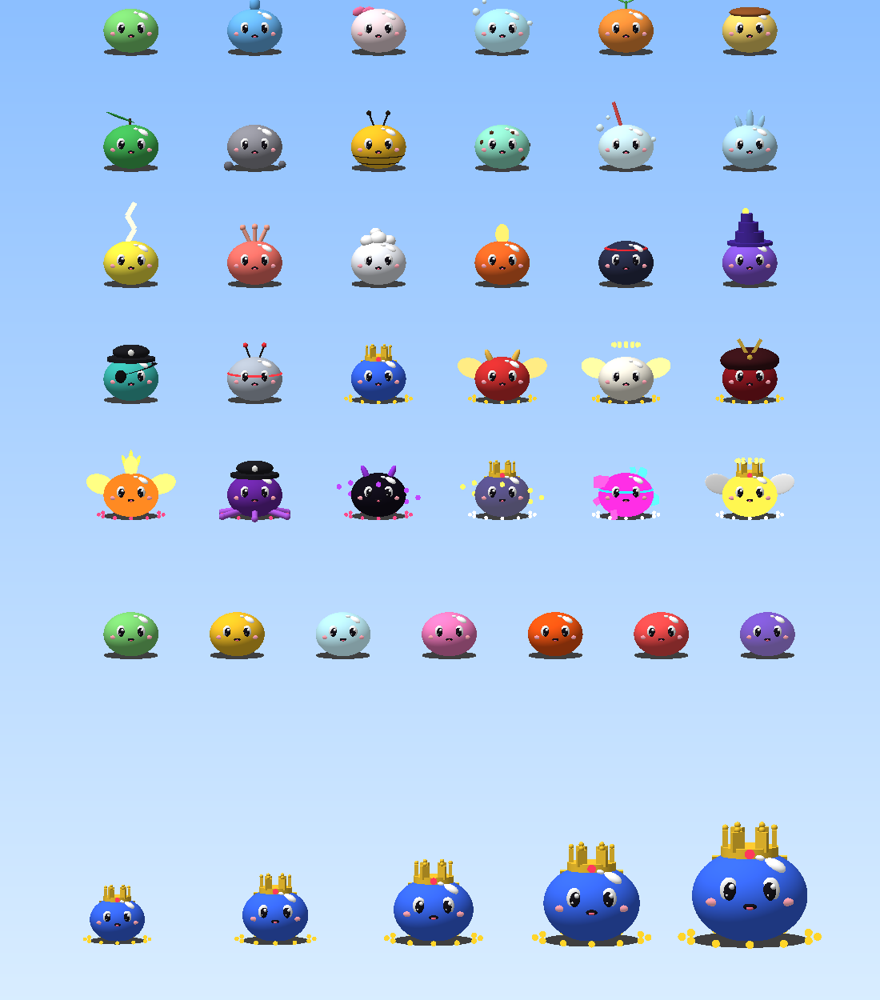
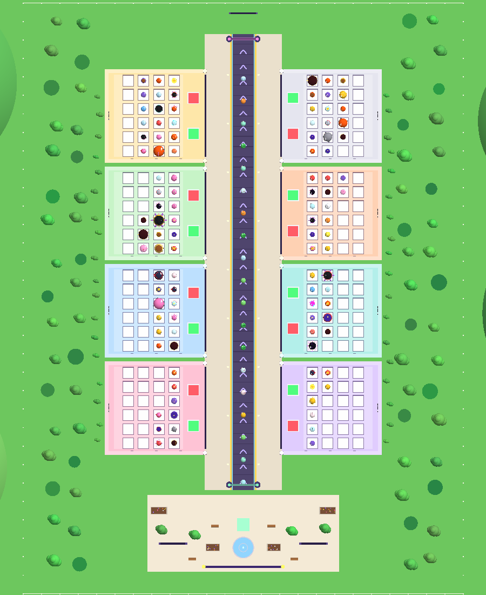
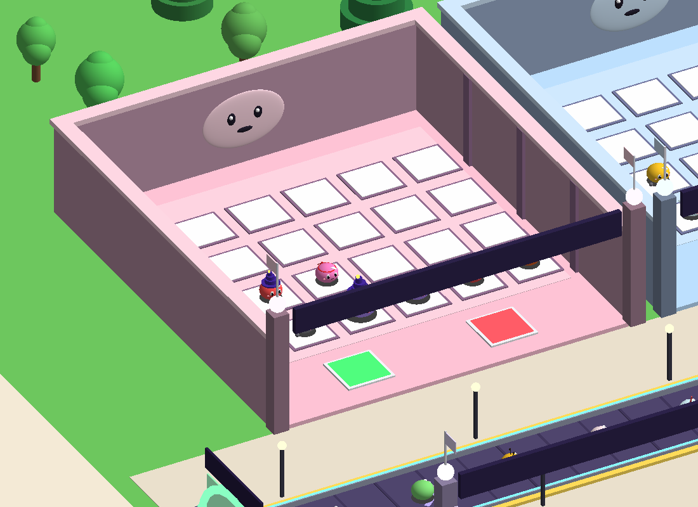
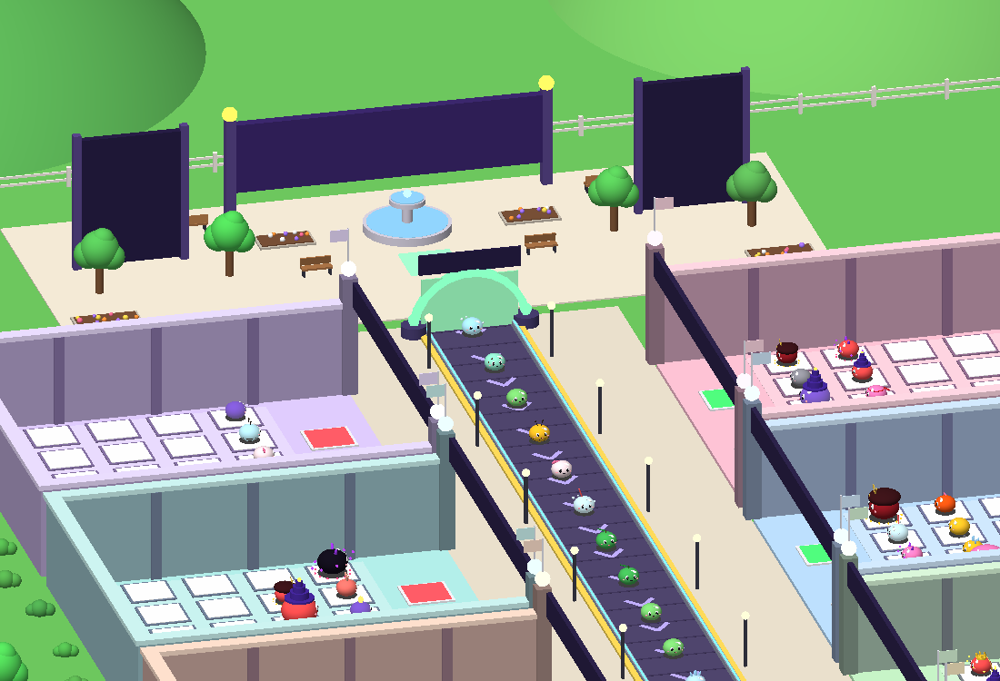
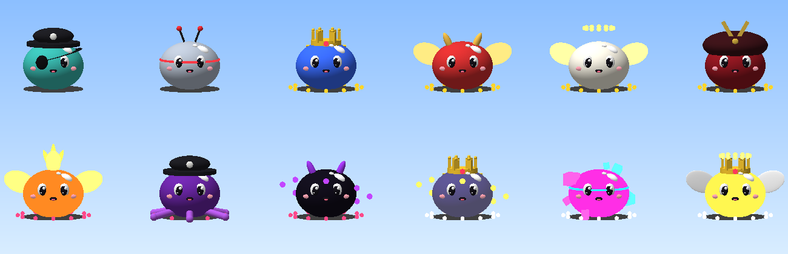

# 슬라임 하이스트! (Slime Heist!) — 로블록스 게임

> 행진하는 슬라임을 사서 내 기지에서 돈을 벌고, 남의 기지에서 제일 비싼 슬라임을 훔쳐 오는 게임.
> 대신 들키면 뿅망치로 맞는다.



| 맵 전체 (위에서) | 기지 | 광장·행진 |
|---|---|---|
|  |  |  |



*(위 그림은 게임 코드로 만든 모델을 간단한 렌더러로 그린 미리보기입니다. 실제 Studio 화면은 조명·그림자·글자·효과가 더해집니다.)*

기획 의도와 설계는 [`docs/GDD.md`](docs/GDD.md), 밸런스 수치는 [`docs/BALANCE.md`](docs/BALANCE.md),
구현·검증 현황은 [`docs/STATUS.md`](docs/STATUS.md)를 보세요.

---

## 1. 바로 해 보기 (개발 지식 없어도 됨)

1. [Roblox Studio](https://create.roblox.com/)를 설치하고 로그인합니다.
2. 이 저장소의 **`roblox/build/SlimeHeist.rbxlx`** 파일을 받아서 Studio로 엽니다(더블클릭 또는 File → Open from File).
3. 위쪽 **▶ Play**(F5)를 누르면 게임이 시작됩니다.
   - 여러 명으로 시험: **Test** 탭 → Clients and Servers → 플레이어 2~3명 → **Start**. 훔치기·뿅망치를 해 볼 수 있습니다.
   - Studio에서는 누구나 관리자라서 채팅에 `/cash 1e9`, `/event rainbow`, `/spawn legendary` 같은 명령을 쓸 수 있습니다(아래 표).
4. Play 전 편집 화면에 보이는 맵은 **미리보기**입니다. 게임이 시작되면 서버가 코드(`MapService`)로 맵을 새로 만듭니다.

> 처음 Play 하면 Output 창에 `DataStore 사용 불가 → 메모리 저장` 경고가 뜹니다. 정상입니다.
> Studio에서도 저장을 시험하려면 먼저 게임을 로블록스에 올린 뒤(아래 2번) **Game Settings → Security → Enable Studio Access to API Services**를 켜세요.

## 2. 로블록스에 출시하기

1. Studio에서 **File → Publish to Roblox** → 새 게임으로 올립니다.
2. **Game Settings**에서:
   - **Places → 최대 플레이어 8명** (기지가 8개라서 꼭 8로 두세요)
   - Security → Enable Studio Access to API Services **ON** (저장·순위표)
   - Avatar → R15 권장
3. (수익화) [Creator Dashboard](https://create.roblox.com/dashboard/creations)에서 게임패스 5개·개발자 상품 5개를 만들고,
   숫자 ID를 `ReplicatedStorage > Shared > Config > Products`(저장소에서는 `src/shared/Config/Products.luau`)의 `id = 0` 자리에 넣습니다.
   ID가 0인 상품은 상점에 안 보이고 혜택도 꺼져 있습니다.
4. (선택) 그룹 보너스: `Products.luau`의 `groupId`에 그룹 ID를 넣으면 가입자 수입 +10%.
5. 게임 아이콘·썸네일을 올리고 공개(Public)로 전환합니다.

## 3. 게임 방법

| 할 일 | 방법 |
|---|---|
| 슬라임 사기 | 가운데 **슬라임 행진**의 슬라임에 다가가서 **E** (모바일: 버튼 탭) |
| 돈 받기 | 내 기지 앞 **초록 발판** 밟기 (금고에 쌓인 돈이 지갑으로) |
| 기지 잠그기 | **빨간 발판** 밟기 또는 🔒 버튼(기지 안에서) — 60초, 끝나면 10초 충전 |
| 훔치기 | 남의 기지 슬라임에 **E 길게 누르기** → 머리에 이고 **내 기지로 달리기** |
| 뿅망치 | **F** / 🔨 버튼 / 게임패드 X — 도둑을 때리면 슬라임을 떨어뜨림 |
| 합성 | 내 슬라임에 E → **합성**: 같은 슬라임·같은 ★ 3마리 → ★+1 (수입 ×3.5) |
| 즐겨찾기 | 내 슬라임에 E → ⭐: 도둑맞지 않고 환생해도 남음(1마리) |
| 환생 | 왼쪽 ♻️: 현금 + 등급 조건 → 수입 영구 +50% |

날씨 이벤트(6분마다)가 슬라임을 **황금 ×2 · 다이아 ×3 · 사탕 ×4 · 용암 ×5 · 무지개 ×7 · 은하 ×10**으로 바꿉니다.
**매시 정각(UTC)** 3분간 **슬라임 대폭주**: 행운 ×5, 수입 ×2 — 모든 서버가 동시에 열립니다.

### 관리자 채팅 명령 (Studio에서는 모두, 라이브에서는 제작자만)

| 명령 | 효과 |
|---|---|
| `/cash 1e6` | 현금 추가 |
| `/event rainbow` | 날씨 시작 (`golden` `crystal` `sugar` `volcano` `rainbow` `meteor` `stop`) |
| `/spawn legendary` · `/spawn dragon galaxy` | 행진에 슬라임 소환(등급 또는 종류 + 변이) |
| `/give king 3 rainbow` | 내 기지에 슬라임 지급(★, 변이) |
| `/luck 600` | 서버 행운 ×2 (초) |
| `/rebirthme` | 환생 조건 채우기 |
| `/wipe` | 내 데이터 초기화 |

라이브 서버 관리자를 추가하려면 `src/server/Services/AdminService.luau`의 `ADMINS`에 userId를 넣으세요.

## 4. 내용 바꾸기 · 늘리기 (확장성)

모든 수치와 콘텐츠는 `src/shared/Config/`의 표에 있습니다. 코드 수정 없이 표만 고치면 됩니다.

**새 슬라임 추가** — `Config/Slimes.luau`에 한 줄:
```lua
{ id = "pumpkin", en = "Pumpkin", ko = "호박이", rarity = "epic", income = 700, color = rgb(255, 140, 20), accent = rgb(60, 150, 50), acc = { "sprout" } },
```
행진·도감·저장·UI에 자동으로 들어갑니다. 가격은 `income × 등급별 회수시간`으로 자동 계산됩니다.

| 바꾸고 싶은 것 | 파일 |
|---|---|
| 슬라임 종류·색·장식 | `Config/Slimes.luau` (장식 모양은 `SlimeBuilder.luau`의 `ACCESSORIES`) |
| 등급 확률·회수시간 | `Config/Rarities.luau` |
| 변이·배수 | `Config/Mutations.luau` |
| 날씨·대폭주 | `Config/Weather.luau` |
| 가격·환생·업그레이드·잠금·뿅망치 | `Config/Economy.luau` |
| 출석·선물·퀘스트 보상 | `Config/Rewards.luau` |
| 게임패스·상품 | `Config/Products.luau` |
| 화면 문구(영어/한국어) | `Config/Text.luau` |
| 효과음·배경음악 | `Config/Audio.luau` |
| 맵 배치 | `Config/World.luau`, `server/Services/MapService.luau` |

수치를 바꾼 뒤에는 `lune run tests/balance.luau 20 8 --write`로 성장 속도를 다시 확인할 수 있습니다.

**소리 바꾸기** — 기본은 로블록스에 내장된 소리라서 아무것도 안 해도 소리가 납니다.
더 좋은 소리를 쓰려면 Creator Store(도구 상자 → 오디오)에서 고른 소리의 ID를 `Config/Audio.luau`의 `custom` 표에 넣으세요.
```lua
local custom = {
	ping = "rbxassetid://1234567890",   -- 동전·화음에 쓰는 짧은 "딩" 소리
	music = "rbxassetid://9876543210",  -- 평소 배경음악(비우면 코드로 연주하는 오르골 음악)
	musicFrenzy = "",                   -- 대폭주 배경음악
	...
}
```
효과 하나하나(수금·합성·환생 등)는 같은 파일의 `cues` 표에서 음정(`p`)·볼륨(`v`)·시작 시간(`d`)을 겹쳐서 만듭니다.

## 5. 개발자용

### 구조
```
roblox/
  default.project.json      Rojo 프로젝트(서비스 설정 포함)
  src/shared/               ReplicatedStorage.Shared — 설정표, 순수 로직, 슬라임 조립, 타입
    Config/                 모든 수치·콘텐츠 표
    Logic/                  Calc(경제 공식) · Roll(뽑기) · Merge · Data(저장 구조·복구) · Progress(퀘스트·출석·대폭주)
    SlimeBuilder.luau       파트만으로 슬라임 3D 모델 조립(에셋 불필요)
  src/server/               ServerScriptService.Server — Main + 서비스 13개
    Services/               Data · Map · Weather · Economy · Plot · Slime · Parade · Steal · Progress · Shop · Leaderboard · Admin
  src/client/               StarterPlayerScripts.Client — UI(HUD·창 9개·커스텀 프롬프트) · 행진 렌더링 · 연출(Fx·WorldFx) · 소리(Sound·Music) · 튜토리얼
  src/first/                ReplicatedFirst — 로딩 화면(준비되면 페이드아웃)
  tests/                    Lune 테스트(단위 · 서버 통합 · 풀스택) + 밸런스 시뮬레이션 + 가짜 로블록스 엔진
  scripts/                  check.sh(전체 검사) · bake-map.luau(미리보기 맵) · preview/(미리보기 렌더러)
  build/                    SlimeHeist.rbxlx(바로 여는 파일) · MapPreview.rbxm
```

### 원칙
- **서버 권위**: 클라이언트는 "하고 싶다"만 보냅니다. 거리·돈·쿨타임·보호 상태는 모두 서버가 검사합니다.
- **복제 방지**: 훔친 슬라임은 배달 완료 순간에만 데이터가 옮겨집니다. 도중에 누가 나가거나 서버가 꺼져도 슬라임이 두 개가 되거나 사라지지 않습니다.
- **저장**: `UpdateAsync` + 세션 잠금(다른 서버의 덮어쓰기 방지) · 60초 자동 저장 · 종료 시 저장 · 버전/손상 복구(`Logic/Data.reconcile`) · 결제 영수증 중복 방지.
- 행진은 클라이언트가 60fps로 그리고 서버는 공식으로 위치를 검증합니다(부드러움 + 보안 + 네트워크 절약).

### 도구 설치
[Rojo](https://rojo.space) 7.7, [luau-lsp](https://github.com/JohnnyMorganz/luau-lsp), [StyLua](https://github.com/JohnnyMorganz/StyLua), [Lune](https://lune-org.github.io/docs) 0.10
(`cargo install rojo stylua lune` 로도 설치됩니다.)

```bash
cd roblox
./scripts/check.sh                          # 전체 검사(아래 5가지)
rojo serve                                  # Studio Rojo 플러그인으로 실시간 동기화
lune run scripts/bake-map.luau && rojo build default.project.json -o build/SlimeHeist.rbxlx   # 배포 파일 다시 만들기
lune run tests/balance.luau 20 8 --write    # 밸런스 시뮬레이션 → docs/BALANCE.md
```

`check.sh`가 하는 일:
1. **luau-lsp strict 타입 검사** — 실제 Roblox API 정의로 모든 파일 검사(속성 이름·타입·메서드 오타를 잡음)
2. **StyLua** 포맷 검사
3. **단위 테스트** 61개 — 공식·뽑기 분포·합성·저장 복구·퀘스트·출석·문구 키·슬라임 420종 조립·소리 설정(큐·음정 범위·코드에서 부르는 소리 이름)
4. **서버 통합 테스트** 75개 — 가짜 로블록스 엔진에서 실제 서버 코드를 부팅해 입장→구매→수금→합성→업그레이드→훔치기→뿅망치→배달→잠금→날씨 변이→환생→보상→관리자 명령→결제→퇴장·재입장·오프라인 수입→종료 저장까지 실행
5. **풀스택 테스트** 45개 — 서버+클라이언트를 함께 실행해 로딩 화면, 소리·음악, UI 생성, 모든 창, 설정 저장·적용, 상점 효과 미리보기, 행진 렌더링·커스텀 프롬프트, 합성·구매 등 연출, 입력·집 안내를 확인
